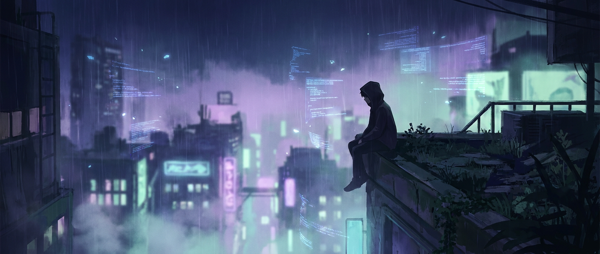

<div align="center">



<br/><br/>

<sub>also known, in dimmer rooms, as **hunterx461**</sub>

<br/><br/>

<!-- WARM PILL ROW -->


</div>

<br/>

<!-- ──────────────────────────────────────────────── -->

<div align="center">

> *good security is a quiet thing —*  
> *a door no one notices is closed,*  
> *a lock that never rattles,*  
> *a goodnight, kept.*

</div>

<br/>

<!-- ABOUT.TXT WINDOW (centered) -->
<div align="center">

```
╭──────────────────────────────────────────────────────────╮
│  ●  ●  ●                                   ~/about.txt   │
├──────────────────────────────────────────────────────────┤
│                                                          │
│   security researcher writing this from a small room     │
│   with a big window. the city is doing its purple        │
│   thing outside. the rain is soft. kettle just clicked.  │
│                                                          │
│   i spend my hours close to smart contracts, malware,    │
│   and the low hum of networks that don't know they're    │
│   being listened to. most of the work is small and slow. │
│                                                          │
│   i read code the way some people read letters —         │
│   patient, suspicious, looking for the line that         │
│   doesn't sit right. that's where everything is hiding.  │
│                                                          │
╰──────────────────────────────────────────────────────────╯
```

</div>

<br/>

<!-- ──────────────────────────────────────────────── -->

<table align="center" width="100%" border="0">
<tr>
<td width="50%" valign="top" align="center">

<h3>✿ &nbsp; tonight's loop</h3>

```
┌────── now spinning ──────────┐
│                              │
│  ♪  lofi hip hop · radio     │
│  ♪  sleeping at last         │
│  ♪  bonobo · linked          │
│  ♪  city pop, 1986           │
│  ♪  rain on a quiet street   │
│                              │
│  ▶ ──●──────────  03:14      │
│  ◁◁    ▶▶    ◯ shuffle ↺  │
│                              │
└──────────────────────────────┘
```

</td>
<td width="50%" valign="top" align="center">

<h3>☕ &nbsp; currently brewing</h3>

```
┌─────── sticky note ──────────┐
│                              │
│  • PROTOCOL ZERO             │
│  • claimguardian ai          │
│  • Thundercipher Campus      │
|    Ambassador                |
│  • fuzzing the unfuzzable    │
│  • someone else's bytecode   │
│                              │
│  ~ coffee count: idk ~       │
│                              │
└──────────────────────────────┘
```

</td>
</tr>
</table>

<!-- ──────────────────────────────────────────────── -->

<h3 align="center">☾ &nbsp; tools within arm's reach</h3>

<div align="center">


<br/><br/>

<table border="0">
<tr>
<td align="center">
  
</td>
<td align="center">
  
</td>
</tr>
<tr>
<td align="center">
  
</td>
<td align="center">
  
</td>
</tr>
</table>

<sub><i>some i love. some i tolerate. all of them have seen me at 3am.</i></sub>

</div>

<br/>

<!-- ──────────────────────────────────────────────── -->

<h3 align="center">✶ &nbsp; a small piece of code above the desk</h3>

<div align="center">

```solidity
// re-read on the hard nights.

contract Node461 {
    function protectTheNetwork() public {
        while (vulnerabilityExists()) {
            research();
            audit();
            patch();
        }
        // and then, finally, rest.
        // the city will still be glowing tomorrow.
    }
}
```

</div>

<br/>

<!-- ──────────────────────────────────────────────── -->

<h3 align="center">❀ &nbsp; the quiet ledger</h3>

<div align="center">

<table border="0">
<tr>
<td>
  
</td>
<td>
  
</td>
</tr>
<tr>
<td>
  
</td>
<td>
  
</td>
</tr>
</table>

<sub><i>numbers are weather. they describe the days, not the work.</i></sub>

</div>

<br/>

<!-- ──────────────────────────────────────────────── -->

<h3 align="center">✦ &nbsp; if you'd like to say hello</h3>

<div align="center">

<a href="https://www.tabrez.tech"></a>
<a href="https://github.com/HunterX461/HunterX461_portfolio"></a>
<a href="mailto:hello@tabrez.tech"></a>

<br/><br/>

<sub><i>i'm slow to reply. but i always do.</i></sub>

</div>

<br/><br/>

<!-- ──────────────────────────────────────────────── -->

<div align="center">


</div>
